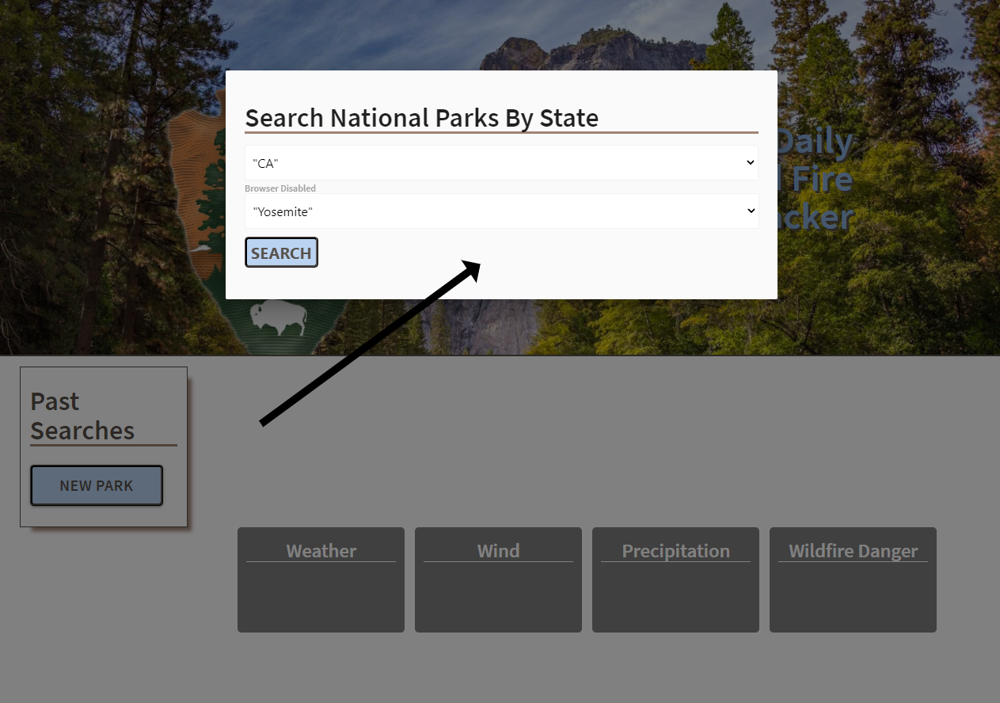
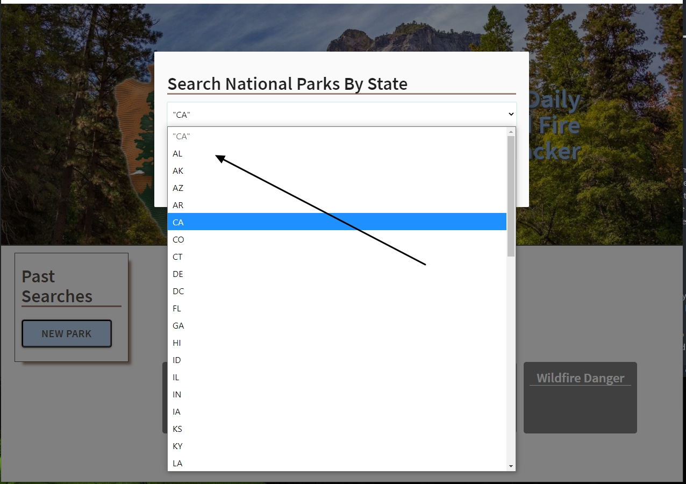
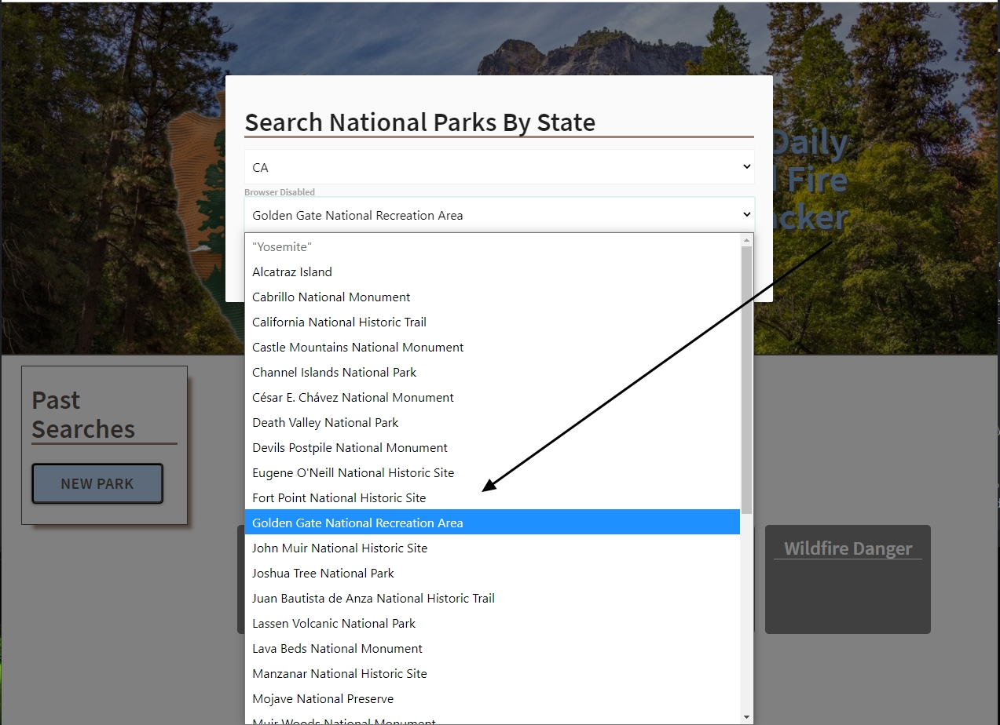
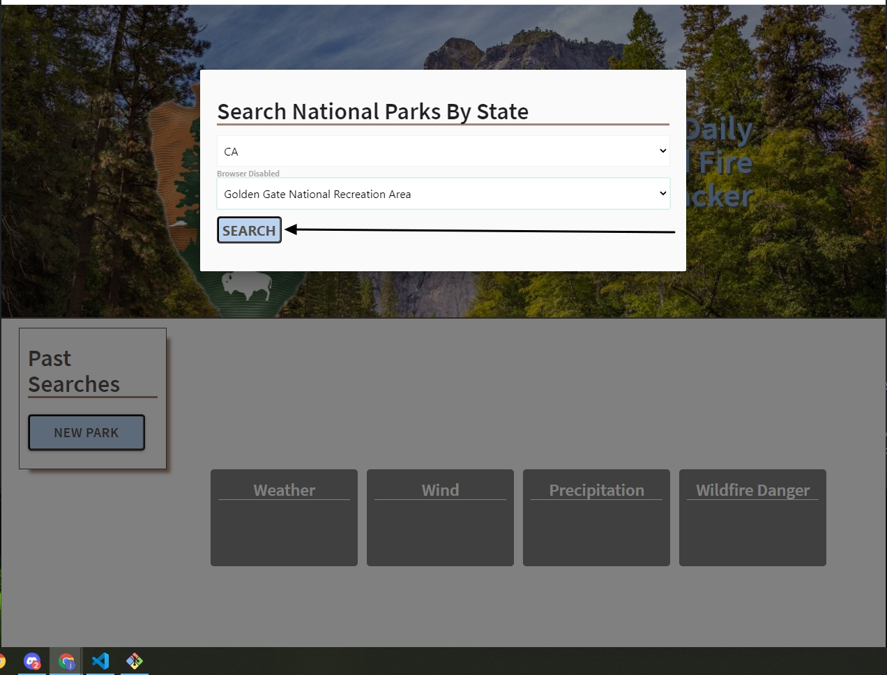
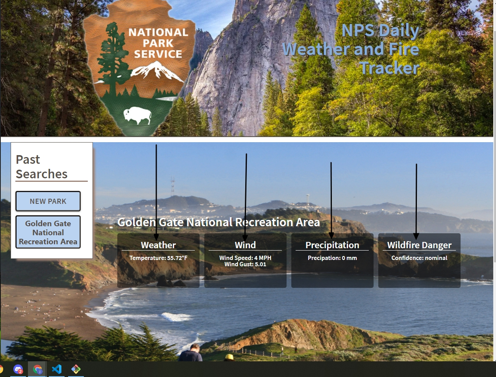
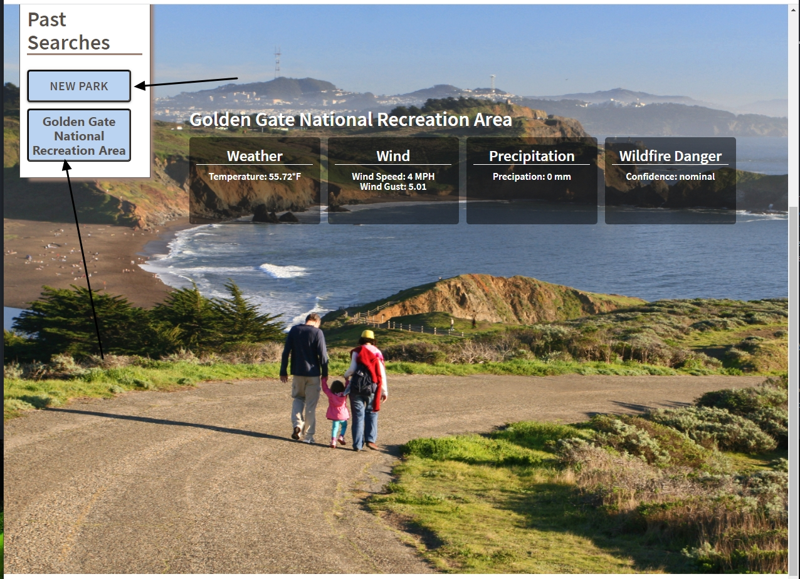

# Weather & Fire Tracker Application
---
Deployable Web Page Link:
\
<https://chuck2076.github.io/Weather_Wildfire_App/>\
Version 1.0 \
Deployment: Oct 6, 2021 \
Contributors: Ethan Cho, Chuck Stephens, Yafet Amare, James Garinger

# Purpose

Weather & Fire Tracker is a web application that renders real time data from three unique API servers for selected national park. Pulling national parks, weather condition, and fire rating data. Our purpose was to allow anyone traveling to designated area to have access to accurate weather and current forrest fire hazards when planning a trip. Or to make a simple inquiry, knowing the data will be precise.

# Page Navigation 
\
When visiting the page you are presented with imagery of one of the many national parks beautiful trails. Followed by a modal button, with past search history located on a left hand sidebar. 

\
When the modal button is clicked, modal populates the page showing two drop down boxes. The first drop down list shows options to choose your desired state of interest.

\
The second dropdown will populate with all national parks in the state you have selected, scroll down if needed and select the nation park of choice.

\
When you have selected a national park, you will want to click on the search button directly below the second dropdown box.

\
After clicking send, you will see the most recent data from your chosen location in labeled information boxes on the redirected page. 

\
If you would like to select a new park after your previous search, you can click the NEW PARK button on the left hand side under the Past Searches bar. After each search, your selection will be added to the past searches history.

# Future Development
Developer ideas pending for future deployment: 
1) Incorporating nearby activities and events for people traveling to national parks. 
2) Implementing website email for travelers to send in real-time national park photos from recent trips to be displayed on web app.
3) Adding a sign up option, storing users email and full name to send out alerts of unusual weather conditions or nearby fires in selected national park/parks of interest. 

# Built Using

<a href="https://materializecss.com" target="_blank">MaterializeCSS</a> \
<a href="https://openweathermap.org/" target="_blank">OpenWeather API</a> \
<a href="https://www.nps.gov/subjects/developer/guides.htm" target="_blank">National Park API</a>  
<a href="https://www.getambee.com/api/fire" target="_blank">Fire Rating API</a> \
JavaScript \
HTML5 & CSS \
jquery

---

<a href="https://github.com/chuck2076/Project_One" target="_blank">GitHub Repository Link</a> 

 
